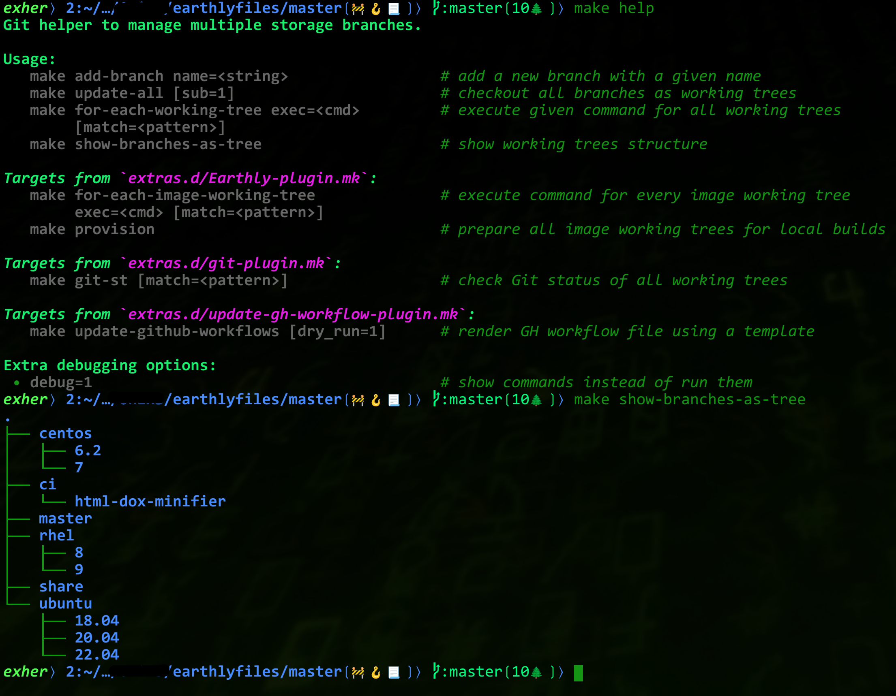

What is This
============

This is a GNU Makefile aimed to work with Git repositories consisting
of multiple branches.


Motivation
----------

It is pretty often, in my experience, to have a Git repository where every branch is dedicated
to things unrelated to each other. Typically, this repo has nothing in the `master`, and most
files are placed in some branch. Examples are:

* the repo with Dockerfiles for CI, where each branch is dedicated to a particular OS/distro.
  I.e., CentOS, Ubuntu, Fedora, etc.;
* the repo with RPM/Deb spec files -- one per (third-party) package;
* the repo with configuration files for various hosts/hardware -- i.e., one per branch;
* etc.

As soon as the count of branches increases, it's going to be a pain to rule them all -- e.g.,
to execute the same command in all branches. To address that issue, this Makefile has appeared.

Git has a neat feature called a *working tree*. It allows having multiple branches checked out
in the file system simultaneously.  I like to name my branches as paths in a filesystem. E.g.,
`release/1.2.3`, `bug/JIRA-123-blah-blah-regression`, `feature/cool-stuff`.  Same for the
mentioned types of repositories: `config/host/ci-agent`, `centos/7`, `ubuntu/18.04`, etc.
I usually clone my repositories with the following command:

```console
~ $ git clone github:repo repo/master
```

So, the project's root resides in the `repo/master` directory after cloning, and to work with
a branch, I do the following:

```console
repo/master$ git worktree add --checkout ../feature/cool-stuff feature/cool-stuff
```

No, I don't use these commands exactly ;-) I have pretty convenient [Git aliases configured][1]
;-) As the result, I'll have this in my working `repo/` directory:

```console
    repo
    ├── feature
    │   └── cool-stuff
    └── master
```

For the *configuration-storage-like* repositories with *a lot* of branches, the `master` has this
`Makefile` only (and the `README`).


Usage
-----

There is nothing to "build" in terms of Make. So, the default target prints the help screen:



Examples:

* Add a new branch:

  ```console
  demo/master$ make add-branch name=hardware/laptop/system76-oryp3
  git worktree add --force --checkout -b hardware/laptop/system76-oryp3 \
  ../hardware/laptop/system76-oryp3 $(git rev-list --max-parents=0 HEAD)
  Preparing worktree (new branch 'hardware/laptop/system76-oryp3')
  HEAD is now at b07071c Demo
  ```

  In my experience, all those branches do not need a *common history*, so I use the very first
  commit in the repo as a branch point. That is why better not to have many files in the repo
  at the very first commit ;-)

* Check the result:

  ```console
  demo/master$ make show-branches-as-tree
  .
  ├── config
  │   └── host
  │       └── my.vpn
  ├── feature
  │   └── demo
  ├── hardware
  │   └── laptop
  │       └── system76-oryp3
  └── master
  ```

* The `for-each-working-tree` can be used to execute arbitrary commands within the working trees:

  ```console
  demo/master$ make for-each-working-tree exec='git status'

  ---[ config/host/my.vpn ] ---
  On branch config/host/my.vpn
  nothing to commit, working tree clean

  ---[ feature/demo ] ---
  On branch feature/demo
  nothing to commit, working tree clean

  ---[ hardware/laptop/system76-oryp3 ] ---
  On branch hardware/laptop/system76-oryp3
  nothing to commit, working tree clean
  ```

  One can use `match=<regex>` parameter to perform the command only for sub-set of branches
  (working trees).

* Finally, as one may guess, the `update-all` target would add work trees for all branches
  currently missed in the filesystem.

[1]: https://github.com/zaufi/etc-files/blob/hardware/notebook/System76-OryxPro/gitconfig#L5
